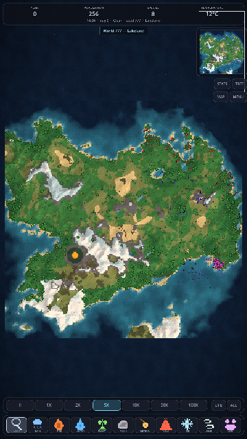
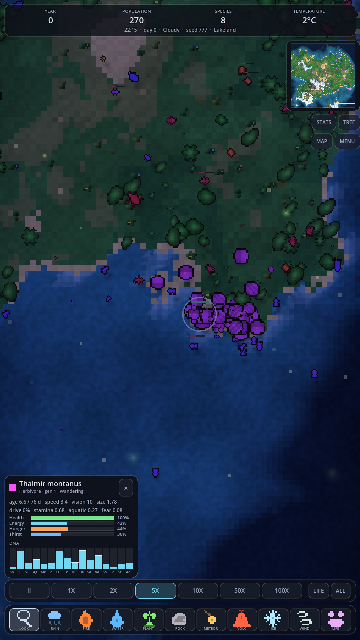
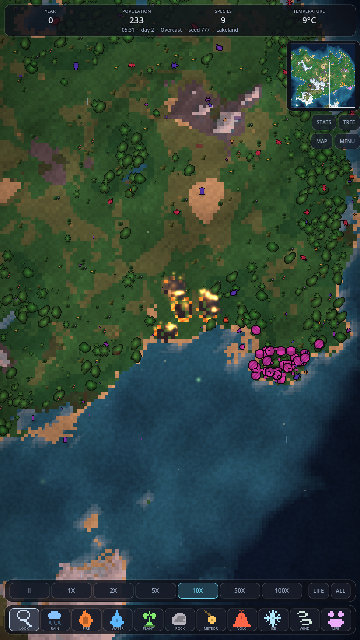
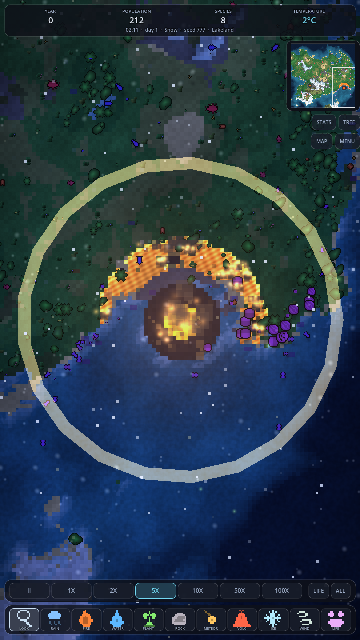
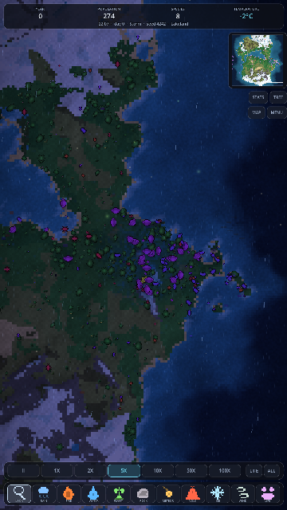
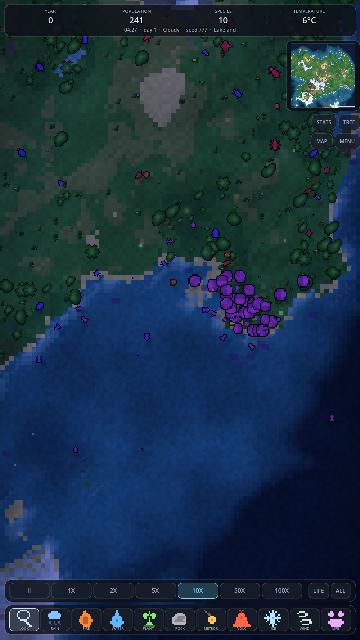
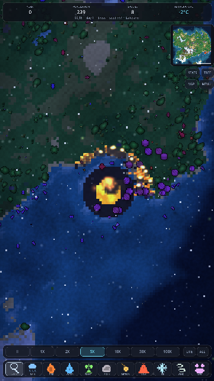
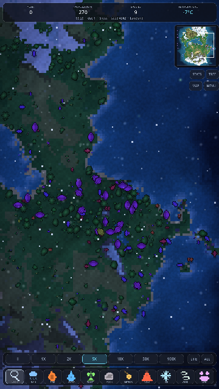
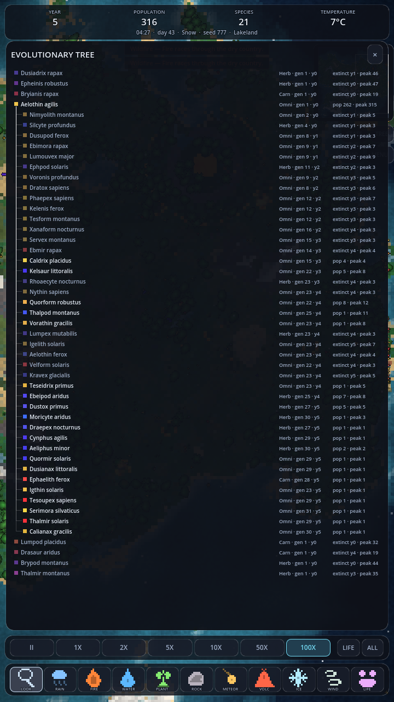
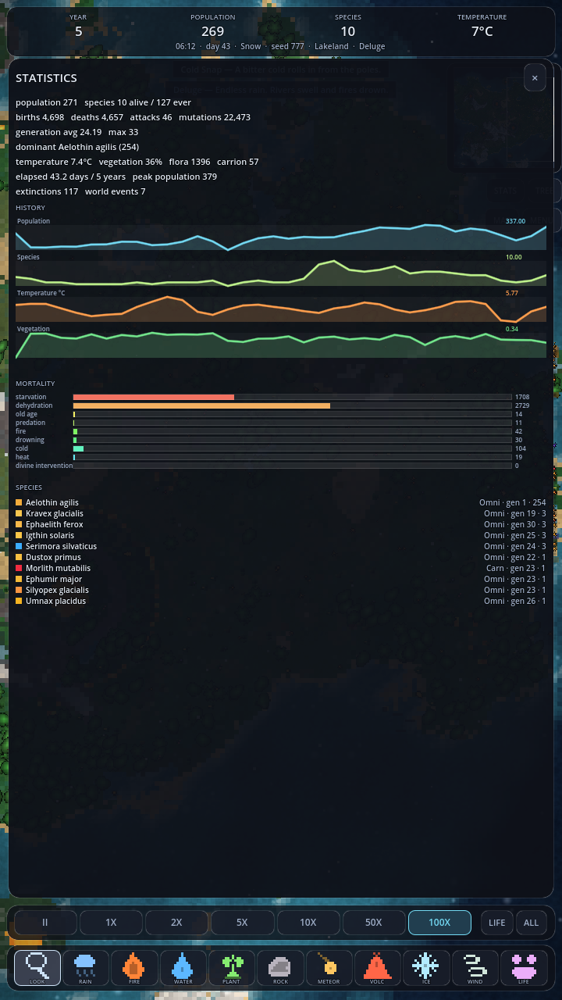

# PIXEL WORLD

A living pixel-art ecosystem for Android. Generate a world from a seed, watch
it fill with animals, and leave it alone — it keeps going without you.
Populations rise and crash, lineages split and die out, fires clear forests
that grow back, and after a few minutes at high speed the creatures on screen
are visibly not the ones you started with.

Built with **Godot 4.3** and **GDScript**. No paid services, no backend, no
image assets: every sprite, icon, gradient and noise texture in the game is
rasterised procedurally at runtime.

| | | |
|:--:|:--:|:--:|
|  |  |  |
| A generated world | Inspecting a creature | A wildfire spreading downwind |
|  |  |  |
| Meteor impact craters | A storm rolling through | Night, with fireflies |
|  |  |  |
| Volcanic eruption | A cold snap | The evolutionary tree |



---

## Running it

You need [Godot 4.3](https://godotengine.org/download) (free, open source).
Nothing else.

```bash
git clone https://github.com/RleonardoDEV/AI.git
cd AI/pixel-world

# Open in the editor and press F5
godot -e .

# Or run it directly
godot .
```

The app goes straight into a world — there is no menu to click through.

### Headless tools

The whole simulation runs without a renderer, which is how it was developed
and balanced.

```bash
# Run the test suite (exits non-zero on failure)
godot --headless res://tests/test_runner.tscn
godot --headless res://tests/test_runner.tscn -- only=genetics

# Simulate thousands of ticks and print a census
godot --headless res://tools/headless_sim.tscn -- seed=777 frames=4000 speed=6

# Micro-benchmark the simulation hot path
godot --headless res://tools/bench.tscn -- seed=777 iters=30000

# Dump generated worlds / sprite sheets to PNG for inspection
godot --headless res://tools/dump_world.tscn -- 12345 4
godot --headless res://tools/dump_sprites.tscn
```

`speed` is an index into `PAUSE, 1X, 2X, 5X, 10X, 50X, 100X`, so `speed=6`
is 100x.

### Android

The export preset (`export_presets.cfg`) is included: arm64, portrait,
immersive, GL Compatibility, with `tools/` and `tests/` excluded from the
package.

```bash
# One-time: install the Android build template from the Godot editor
#   Editor > Manage Export Templates > Download and Install
# and point Editor Settings > Export > Android at your SDK + JDK 17.

godot --headless --export-release Android build/pixel-world.apk
# or, for a debug build you can sideload immediately:
godot --headless --export-debug Android build/pixel-world.apk
adb install -r build/pixel-world.apk
```

The renderer is **GL Compatibility** (OpenGL ES 3.0), so it runs on old
hardware and needs no Vulkan support.

---

## Controls

| Gesture | Result |
|---|---|
| One finger drag (Look tool) | Pan the camera |
| One finger drag (any other tool) | Paint with that tool |
| Two fingers | Pinch zoom, pan |
| Tap a creature (Look tool) | Open its inspector |
| Tap the minimap | Fly there |
| `LIFE` | Jump to the busiest part of the world |
| `ALL` | Frame the whole world |

**Tools.** Rain, fire, water, plant, rock, meteor, volcano, ice, wind and
creature. Fire spreads with the wind and burns real vegetation. Water sinks
the ground and floods it. Meteors leave a lava core, an ash ring and a raised
rim, and kill everything at the epicentre. Volcanoes keep erupting. Ice
freezes water and drops the local temperature until it thaws.

**Time.** `PAUSE / 1X / 2X / 5X / 10X / 50X / 100X`. One simulated day is 60
seconds at 1X, and a year is eight days — so at 100X a century of evolution
takes a few minutes.

---

## What is actually being simulated

### Creatures

Every animal carries state, not just a position:

```
position  velocity  species  age  health  energy  hunger  thirst
speed  vision  aggression  reproduction_drive  fear  stamina
target  memory (water, forage, threats, birthplace)  generation  DNA
```

Behaviour is **utility-scored**, not scripted. Eleven behaviours — forage,
eat, seek water, drink, hunt, flee, flee fire, court, rest, migrate, wander —
are scored every update from needs and surroundings, and the highest wins
(with a little hysteresis so animals commit to a decision instead of
twitching between two near-equal ones).

What that produces, without any of it being written as a rule:

- Herds form, graze a patch down, and move on.
- Predators pick off stragglers at the edge of a herd.
- Prey abandon a watering hole while a predator is sitting on it.
- Whole populations drift toward the equator during a cold snap.
- Mixed-species stampedes away from a fire front.
- Boom-and-bust predator/prey cycles, and occasional local extinctions.

### Genetics

16 genes: speed, size, vision, aggression, metabolism, fertility, lifespan,
preferred temperature, diet, three colour genes, social, fear, stamina and
aquatic tolerance.

Reproduction does per-gene uniform crossover with blending, then gaussian
mutation, with a small chance of a **macro mutation** six times the normal
step. Species are emergent: when a newborn's weighted genetic distance from
its parent species' centroid crosses a threshold, it founds a new species
and records which species it came from. That parent/child chain is what the
evolutionary tree screen draws.

The genes are visible, not just numbers. Body proportions come from DNA — a
fast lineage grows leaner with longer limbs, an aggressive one grows spines
and horns — and diet picks the colour band (plant eaters run blue to violet,
omnivores amber, meat eaters crimson to orange). After a few hundred
generations the populations on screen do not look like the ones you started
with.

### The world

Generation pipeline, all from one seed:

1. Warped fractal relief plus ridged mountain chains.
2. An archetype falloff — **continent**, **archipelago**, **lakeland** or
   **pangaea** — each with its own target water coverage.
3. A histogram remap that converts the noise field to a rank and assigns
   exact coverage to abyss, open water, shallows, coast, habitable land and
   highland. This step matters: without it, fixed thresholds drift wildly
   between seeds and most worlds come out as one grey massif.
4. Rivers, traced by steepest descent on the *smooth* relief (the remapped
   field has plateaus that trap the walk), carving channels to water level
   and eroding their banks.
5. Moisture from noise plus a distance field to open water.
6. Temperature from latitude, a lapse rate, and noise.
7. 14 biomes, 14 terrain materials, volcanism, baked hillshade and shoreline.

Live systems on top: cellular fire that spreads with the wind and eats
vegetation as fuel; surface water that flows downhill, soaks in and
evaporates; logistic vegetation regrowth; flora that grows through stages,
burns, and seeds nearby ground; a weather state machine whose lightning
starts real wildfires; and nine world events (drought, deluge, wildfire,
cold snap, heat wave, meteor shower, eruption, great bloom) that all change
the ecology rather than just the palette.

A day/night cycle drives a single colour grade every layer reads, so ground,
plants and animals are lit by the same light.

---

## Architecture

```
core/          EventBus, tunables, spatial grid, profiler
simulation/    the orchestrator, its clock, the shared context, statistics
entities/      creature state, pooled entity/corpse manager
ai/            perception, utility scoring, steering, combat
genetics/      genome + operators, species, species registry (speciation)
world/         cell state, generation, climate, weather, fire, water,
               growth, flora, and every world-altering tool
biomes/        biome classification and its presentation data
procedural/    sprite/flora/icon/noise rasterisation, name generation
rendering/     terrain, entities, flora, sky, camera, sprite atlas, shaders
effects/       particle pools, ambient life, impact feedback
ui/            HUD, tools, speed, minimap, inspector, statistics, tree, debug
persistence/   save/load
tests/         test kit + five suites
tools/         headless simulation, benchmark, dumps
```

A few decisions worth explaining:

**The world is arrays, not nodes.** Cell state lives in parallel packed
arrays (structure of arrays). 65k cells stay cache-friendly, serialise in one
block, and can be baked straight into an image without touching the scene
tree.

**The terrain is one sprite.** One texel per cell, one draw call, and a
single fragment shader for every ambient effect: depth-aware animated water,
shoreline foam, wind combing through grass, lava and fire emission, cloud
shadows, rain wetness, snow sparkle, heat shimmer. Cell changes are re-baked
into the albedo and uploaded at most once a frame, and only when something
actually changed.

**Sprites are implicit shapes, not bitmaps.** Creature art is rasterised by
sampling a shape function in a rotated local frame. That gives clean
8-direction pixel art with no runtime rotation, and lets body proportions
follow the genome.

**Nothing talks across layers directly.** Systems communicate through
`EventBus`, so `simulation/` never references `ui/` — which is exactly what
makes the headless mode possible.

More detail in [docs/ARCHITECTURE.md](docs/ARCHITECTURE.md).

---

## Performance

The target is 60 FPS on a phone, and the design gets there by trading
simulation *resolution* for frame rate rather than dropping frames:

- **Adaptive striding.** Creatures update in `1/stride` slices per tick with
  a proportionally larger `dt`, and the budget self-tunes against measured
  frame time. Per-frame cost is roughly flat in both speed and population.
- **Time compression.** Past a per-frame tick cap, extra simulated time folds
  into a larger `dt` instead of more ticks, so 100x costs no more than 1x.
- **Chunked sweeps.** Whole-grid systems (growth, thermal relaxation, flora)
  process one chunk per frame with a scaled `dt`.
- **Bounded everything.** Spatial queries are capped (herds make
  neighbourhoods arbitrarily dense — a real O(n²) trap), water processing is
  capped after storms, dirty-cell queues are capped, particle pools are
  fixed-size and drop rather than grow.
- **Level of detail.** Off-screen creatures take an extra stride multiplier;
  shadows, specular detail and health bars switch on with zoom.
- **Draw passes grouped by texture.** Interleaving shadow/body/detail per
  creature cost three draw calls each; grouping by texture collapsed ~1400
  draw calls to ~350.

The in-game debug overlay (`MENU > DEBUG`) shows frame time, entity counts,
scheduling, per-system timings and draw calls. `tools/bench.tscn`
micro-benchmarks the hot path — perception and resource search were 31µs and
32µs per call before inlining, 17µs and 12µs after.

---

## Persistence

A save is **a seed plus a delta**. Loading regenerates the world from its
seed — deterministic — and then replays only the cells that were permanently
changed: craters, floods, raised rock, lava. Fields that recover on their own
(vegetation, snow, puddles) are stored quantised to one byte per cell, and
derived layers (temperature, hillshade, shoreline) are recomputed. The result
is tens of kilobytes for a 65k-cell world with 500 animals, and a load that
cannot drift from what generation would produce.

`MENU` has `SAVE`, `LOAD`, `NEW WORLD` and `COPY SEED`.

---

## Tests

50 tests, ~15,000 assertions, in five suites:

```bash
godot --headless res://tests/test_runner.tscn
```

- **genetics** — gene bounds, crossover between parents, mutation behaviour,
  the distance metric, speciation thresholds, and colour readability (hues
  must avoid grass green and water cyan).
- **world** — seed determinism, land/water share across seeds, field
  normalisation, biome variety, shoreline baking, inland water, delta
  tracking.
- **creatures** — phenotype derivation, needs, every cause of death, world
  bounds, that land animals never stand in open water, reproduction and
  inheritance.
- **ecology** — fire spread and burn-out, rain extinguishing, evaporation,
  regrowth, every tool, meteor craters, the spatial grid including its cap,
  weather events and their recovery, calendar rollover.
- **simulation** — the frame budget at every speed, pause, long-run
  stability with bookkeeping cross-checks, that evolution actually produces
  generations and species, and save/load round trips including genome
  fidelity.

The suites are not decoration: the persistence test caught a real
out-of-bounds bug in the flora free list, and the colour test exists because
the first screenshots showed green herbivores on green grass.

---

## Balance notes

The ecology needed real iteration, and the fixes are worth recording because
each one came from reading a census rather than guessing:

- Deep water is a **hard constraint**, not a movement penalty. Steering alone
  let fleeing herds run into the sea and drown by the dozen.
- The **waterline is drinkable**. Before that, land animals walked to the
  coast, were blocked by water they could not enter, and died of thirst
  beside the sea.
- Courtship is scaled by **satiety**. At full reproductive drive it outranked
  hunger and thirst, and populations starved while breeding.
- Density stress counts **conspecifics only**. Counting every neighbour meant
  predators — which by definition live inside prey herds — could never breed,
  and every carnivore lineage went extinct.
- Movement energy is **linear in speed**, not quadratic. Fast predators used
  to bankrupt themselves in a single chase and never reach breeding energy.
- **Fed predators do not hunt**, which stops them wiping out their own prey.
- Newborns **inherit their parents' memory** of water and grazing.
- A species past ~42% of the biosphere breeds against rising resistance.
  Without that, whichever r-strategist won first crowded every other lineage
  off the map and the world became one colour.

---

## Licence

MIT. Godot Engine is MIT licensed; no other third-party code is included.
